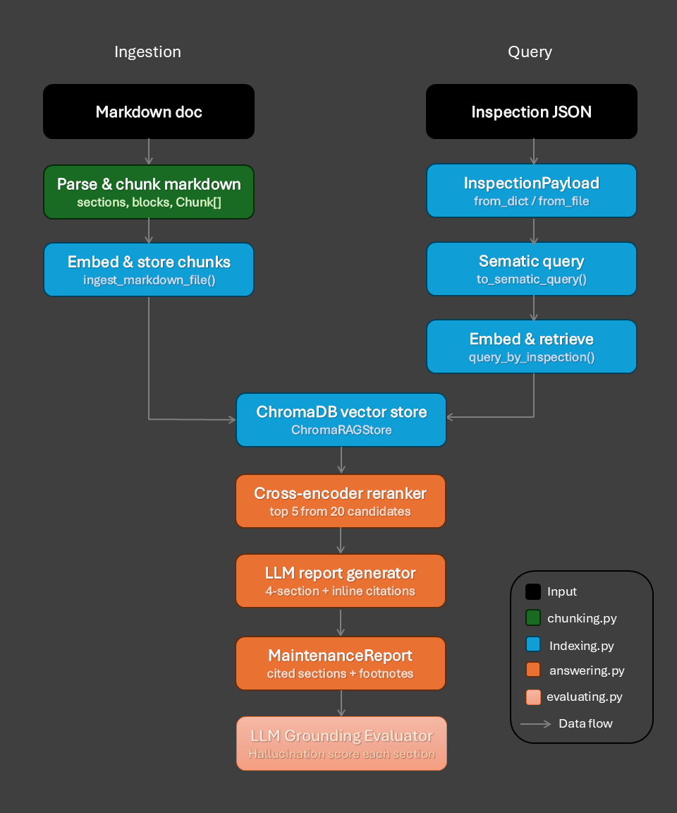

# Project Description
This RAG pipeline is part of Project 6 - Road Crack Detection. The RAG system is designed to automatically generate engineering reports for bridge and road infrastructures with detectable cracks. It transforms crack metrics into grounded, actionable and maintenance recommendations. 

# RAG Pipeline 

## Library installation
Create a conda environment
```
conda create --name project6rag
conda activate project6rag
```

Install the necessary libraries
```
pip install pymupdf marker docling openai sentence-transformers tiktoken nltk chromadb streamlit
```

## Architecture


## Stage 1: Document preparation (`01_PDF_Processing.ipynb`)
Converts raw PDF documents into markdown files. The markdown files need to have appropriate headings, and will be used for chunking and embedding. Here is the list of documents. 

| Document Category | Target Manual Title                                                       | Why need it                                                   |
|-------------------|---------------------------------------------------------------------------|---------------------------------------------------------------|
| Bridges           | VicRoads Road Structures Inspection Manual (https://shorturl.at/g55yP)                      | Defining condition states for bridge components.              |
| Roads/Pavement    | VicRoads Technical Bulletin TB 50: Guide to Surface Inspection Rating (https://shorturl.at/vtGv9)    | Focuses on asphalt and sprayed seal surfaces.                 |
| Repair Standards  | VicRoads Section 687: Repair of Concrete Cracks (https://shorturl.at/hE54s)                          | Provide engineering methods the LLM should recommend.         |
| Repair Standards  | VicRoads Section 689: Cementitious Patch Repair (https://shorturl.at/bMeGh)                          | Useful for larger spalling or severe crack repairs.           |
| General           | Austroads Guide to Bridge Technology (Part 7: Maintenance and Management) (https://austroads.gov.au/publications/bridges/agbt07) | Used across Australia to provide general maintenance context. |

## Stage 2: Chunking (`chunking.py`)
This is the document preparation layer where the headings (`#, ##, ###`) are parsed into breadcrumbs `section_path` (e.g. 1. Chapter 3 > 1.1. Retrieval > 1.1.1. Dense Retrieval). Then each section is split into sematic blocks (paragraph, table, bullet list, code block). Each block is separated by blank line. Then further split any oversized block (over 4000 token) using sentence sliding window with token overlap. Each block becomes a `Chunk` object with SHA-256 id, and an enriched `embedding_text` that prepends metadata like source file, section path and corresponding text. This allows each chunk to have a structural context, not just raw content.

## Stage 3: Indexing (`indexing.py`)
Embeds the chunks in batches with OpenAI embeddings and upserts them into ChromaDB. The SHA-256 chunk ID makes re-ingestion idempotent meaning chunks can be skipped if they are unchanged. 

## Stage 4: Retrieval (`indexing.py`)
Takes crack detection `InspectionPayload` object (crack JSON metrics) and converts it into English sentences before embedding it. Since vector search works on sematic meaning, by matching descriptive sentences against each other, the search will give better recall when compared to matching raw numbers. Top-20 candidates are returned from the vector store. 

## Stage 5: Reranking (`answering.py`)
A cross-encoder `ms-marco-MiniLM-L-6-v2` model is used to rerank each (query, candidate/retrieved chunk) pair. From the top 20 candidates, we pick top 5 most relevant chunks. 

## Stage 6: Generation (`answering.py`)
Builds a structured engineering prompt based on the `InspectionPayload` object and top 5 candidates. Then call an LLM to produce a 4 section report. After getting the raw LLM output, the citations are extracted and verified with the chunk metadata to prevent citation hallucinations. 

## Stage 7: Evaluation (`evaluating.py`)
Sends each section and the retrieved context to another LLM to judge the quality and hallucination risk of the output. 

## Example output
To view the web dashboard of the output, run 
```bash
streamlit run app.py
```

To demonstrate the RAG pipeline in action, run:

```bash
python main.py
```

This produces output showing how crack metrics can be transformed into a maintenance report.
```
==============================================================
 CRACK METRICS IN JSON FORMAT
==============================================================
  InspectionPayload(image_id='bridge_01.jpg', num_crack_regions=3, largest_crack_area_ratio=0.05, largest_crack_length=438.0, severity='high', damage_level=6.75)

==============================================================
  TRANSFORM CRACK METRICS INTO NATURAL LANGUAGE QUERY
==============================================================
  high severity crack damage detected on bridge structure. Largest crack area ratio 0.05, estimated length 438px across 3 region(s). Overall damage level 6.75. Recommended repair actions and inspection schedule for high severity concrete cracking.
Search returned 20 result(s).
Search returned 5 result(s).

==============================================================
  STRUCTURAL INSPECTION MAINTENANCE REPORT
==============================================================
  Asset / Image  : bridge_01.jpg
  Severity       : high
  Generated At   : 2026-04-07T12:56:45.026751+00:00
==============================================================

──────────────────────────────────────────────────────────────
  1. FINDINGS SUMMARY
──────────────────────────────────────────────────────────────
  The inspection of bridge_01.jpg identified 3 crack regions with a largest crack area ratio of 0.0500 and a largest crack length of 438.0 px. The reported severity was high and the damage level was 6.75. Model confidence is not provided in the inspection data.

──────────────────────────────────────────────────────────────
  2. RISK ASSESSMENT
──────────────────────────────────────────────────────────────
  Cracking has been recorded and should be interpreted in terms of its potential structural implications and its effect on component and overall structural performance. [4] For concrete components, the presence and extent of cracking can indicate conditions ranging from minor cracking to more significant cracking and associated durability concerns; however, most forms of concrete deterioration are typically more significant for durability effects than for strength. [3] Given the inspection-reported severity as high and the measured largest crack length (438.0 px) and crack area ratio (0.0500), the condition warrants careful assessment of performance impacts and consideration of factors that may accelerate deterioration. [4]

──────────────────────────────────────────────────────────────
  3. RECOMMENDED REPAIR ACTIONS
──────────────────────────────────────────────────────────────
  1. Crack documentation should be completed for each crack by recording length, width, location, and orientation (horizontal, vertical, diagonal, etc.), and by indicating whether rust stains, efflorescence, or evidence of differential movement are present on either side of each crack. [1]
  2. The observed cracking should be interpreted by assessing first the effect of the damage on the performance of the component and second how the integrity of the whole structure is affected, including comparison of foundation movements and estimated actual loads with those assumed in the original structural analysis. [4]
  3. For prestressed structures, conformity checks should be undertaken for structural analysis, drawings, actual stressing forces, and the effects of concrete shrinkage and creep, as part of interpreting the observations. [4]
  4. Environmental factors that may accelerate deterioration should be considered during the assessment and planning of strengthening/rehabilitation measures. [4]

──────────────────────────────────────────────────────────────
  4. INSPECTION SCHEDULE / NEXT STEPS
──────────────────────────────────────────────────────────────
  1. A follow-up inspection should be scheduled to confirm crack characteristics (length, width, location, orientation) and to document the presence or absence of rust stains, efflorescence, and differential movement evidence on either side of the cracks. [1]
  2. The next steps should include a review of existing codes, structural analyses, drawings, specifications, soil investigations, construction records, and previous inspection reports, and should incorporate comparison of foundation movements and estimated actual loads with original assumptions. [4]
  3. For prestressed structures, follow-up should include checks of structural analysis, drawings, actual stressing forces, and the effects of concrete shrinkage and creep, and should consider environmental factors that may accelerate deterioration. [4]

──────────────────────────────────────────────────────────────
  REFERENCES
──────────────────────────────────────────────────────────────
  SOURCES:
    [1] Austroads Guide to Bridge Technology Part 7 — 5. Maintenance > Prestressed Concrete Substructures
    [3] Austroads Guide to Bridge Technology Part 7 — 4. Bridge Assessment and Load Rating > Concrete
    [4] Austroads Guide to Bridge Technology Part 7 — 6. Rehabilitation and Strengthening Treatments > Interpretation of Observations

==============================================================

==============================================================
  RETRIEVED CONTEXT FROM VECTOR STORE AND RERANKING
==============================================================
  When reporting cracks record the length, width, location, and orientation (horizontal, vertical, diagonal, etc.) of each crack. Also indicate the presence of rust stains, efflorescence, or evidence of differential movement on either side of the crack. While cracking of structural significance may indicate overstress, most forms of concrete deterioration (spalling, scaling, efflorescence) usually are most significant in their effects on durability rather than strength. Structural implications of cracks and distortions are assessed by considering first the effect of the damage on the performance of the component, and second how the integrity of the whole structure is affected. Existing codes, structural analyses, drawings, specifications, soil investigations, construction records and previous inspection reports should be studied. Foundation movements and estimated actual loads should be compared with those assumed in the original structural analysis. For prestressed structures the conformity of structural analysis, drawings, actual stressing forces, and the effects of concrete shrinkage and creep should be checked. Environmental factors that may accelerate deterioration should also be considered.

==============================================================
  EVALUATION OF REPORT
==============================================================
  Risk of hallucination: medium
  risk_assessment: medium - The section generally aligns with the context’s guidance that cracking should be assessed for structural performance and that concrete deterioration is often more significant for durability than strength. However, it introduces specific interpretive claims and thresholds not present in the provided context (e.g., linking the reported 'high' severity and specific measured crack metrics to a particular need for 'careful assessment of performance impacts' and 'consideration of factors that may accelerate deterioration' in a way that goes beyond the context). The context does not support the specific numeric interpretation or the implied conclusion structure.

  repair_actions: low - All four repair actions closely mirror statements in the retrieved context: crack documentation details (length/width/location/orientation and rust/efflorescence/differential movement), assessment of structural performance and overall integrity including comparison of foundation movement and actual vs assumed loads, prestressed conformity checks including stressing forces and shrinkage/creep effects, and consideration of environmental factors accelerating deterioration. No additional requirements beyond the context are introduced.

  inspection_schedule: low - All three inspection items directly reflect the retrieved context: recording crack dimensions/location/orientation and associated rust/efflorescence/differential movement; reviewing codes, analyses, drawings/specs, soil investigations, construction records, and prior reports and comparing foundation movement/loads; and for prestressed structures checking analysis/drawings/actual stressing forces, shrinkage/creep, and environmental factors. No additional requirements beyond the context are introduced.
```

For further query please contact: Long Tran (s223128143)