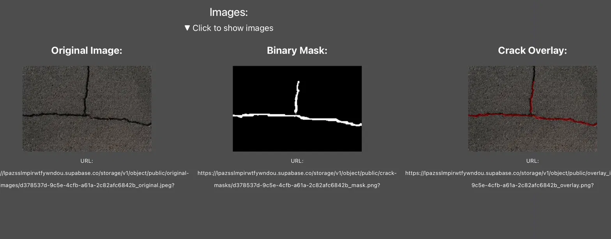
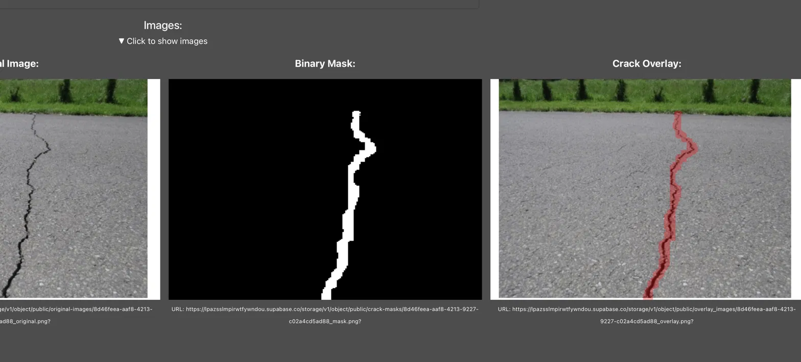
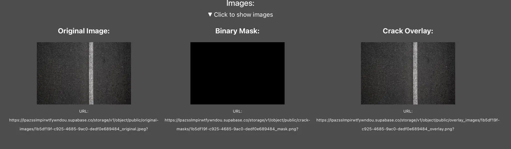
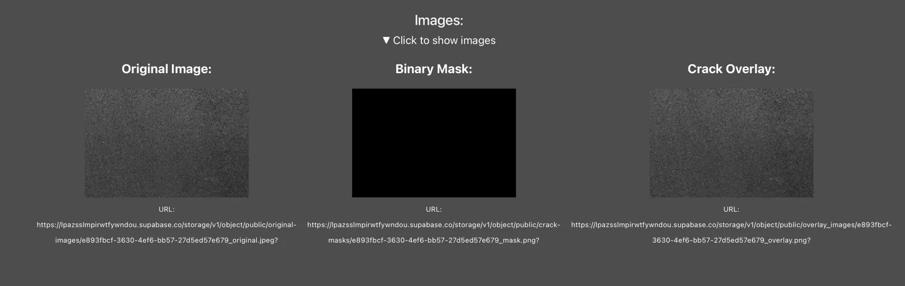
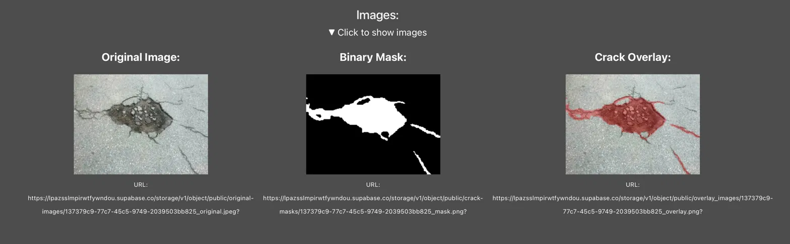
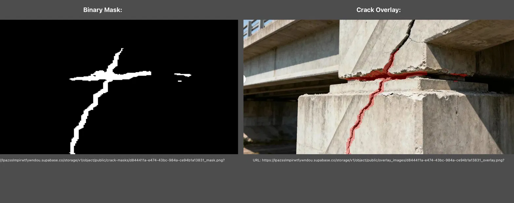

# Edge Case Testing — Crack Detection Model

## Overview
The following edge cases were tested by uploading images through the full pipeline — from the UI through the crack detection model, Supabase storage, crack metrics generation, and LLM RAG report generation. All three images (original, binary mask, and crack overlay) were stored in Supabase Storage and the results were saved to the database.

---

## Test Cases

### 1. Normal Crack (Pavement)
**Description:** Standard pavement image with a visible crack running across the surface.  
**Result:** ✅ Passed — clean binary mask and red overlay produced.

---

### 2. Real Life 3D Background
**Description:** Road crack image with a natural background including grass.  
**Result:** ✅ Passed — model handled the real-world environment well with no false positives from the background.

---

### 3. Road Markings (No Crack)
**Description:** Road surface with a white road marking/line but no actual crack.  
**Result:** ✅ Passed — empty mask returned, road marking correctly ignored.

---

### 4. Clean Road (No Crack)
**Description:** Plain road surface with no cracks or markings.  
**Result:** ✅ Passed — no crack detected, empty mask and clean overlay returned.

---

### 5. Pothole
**Description:** Road surface with a pothole rather than a crack.  
**Result:** ✅ Passed — model detected and highlighted the pothole, suggesting it generalises to other types of road damage beyond cracks due to similar dark irregular pixel patterns.

---

### 6. Bridge Structural Crack
**Description:** Close-up of a concrete bridge pillar with visible structural cracks running diagonally across the surface, with a complex 3D background.  
**Result:** ⚠️ Partially Passed — model correctly detected the main structural cracks on the bridge pillar and ignored the background, but missed the upper portion of the diagonal crack and potentially misclassified the structural joint between bridge segments as a crack.

---

## Summary

| Test Case | Result |
|-----------|--------|
| Normal Crack | ✅ Passed |
| Real Life 3D Background | ✅ Passed |
| Road Markings | ✅ Passed |
| Clean Road | ✅ Passed |
| Pothole | ✅ Passed |
| Bridge Crack |⚠️ Partially Passed |

The model performed well across all 6 edge cases with no critical failures. Notably, the model generalised to potholes and bridge structural cracks despite not being explicitly trained on either, demonstrating robustness to different surface types and damage categories. The bridge test case revealed some limitations — the model missed part of a diagonal crack and potentially misclassified a structural joint — however it still correctly identified the main crack on a complex 3D concrete surface, which is a strong result given the training data consists primarily of flat road surfaces.
