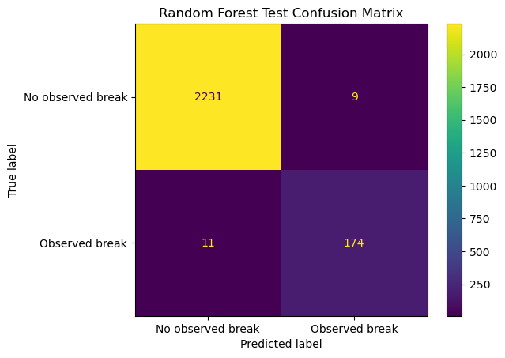
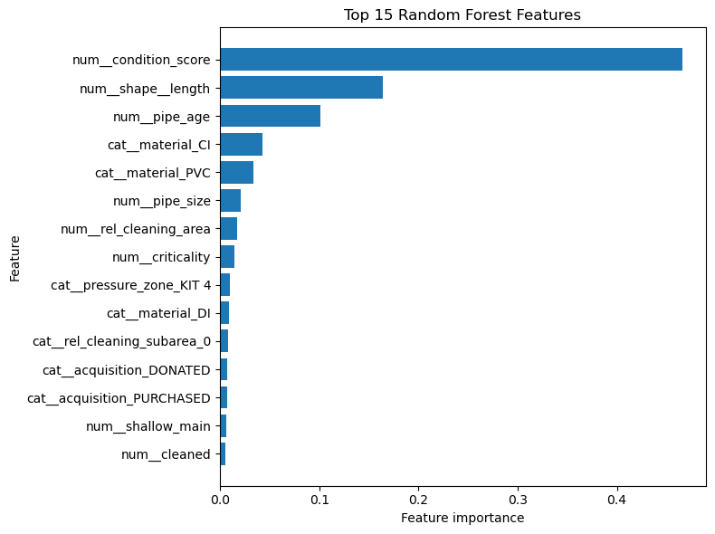
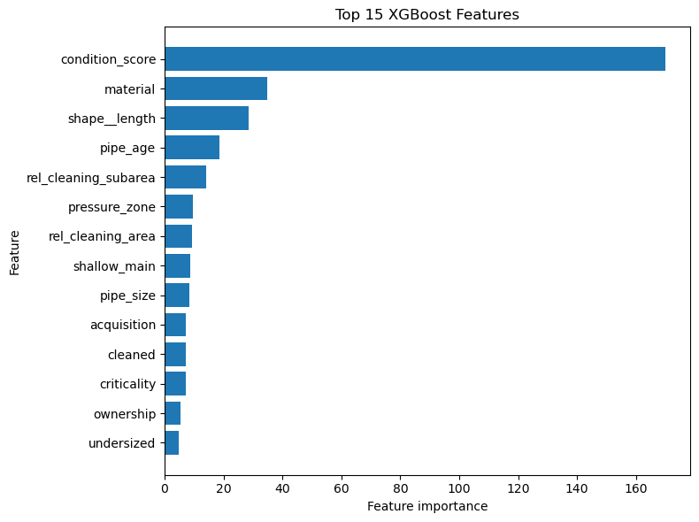
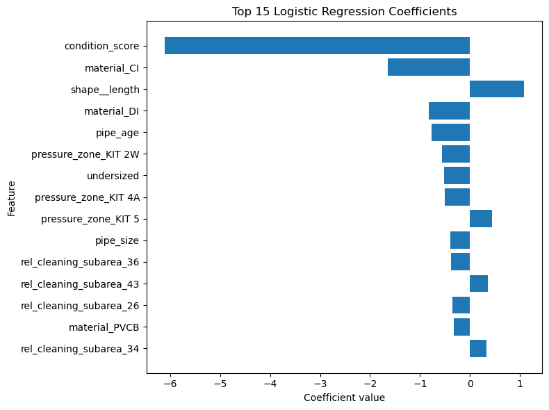
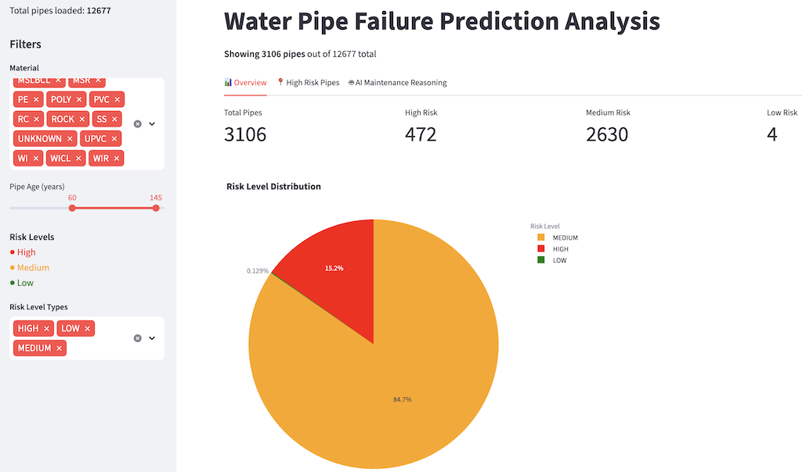
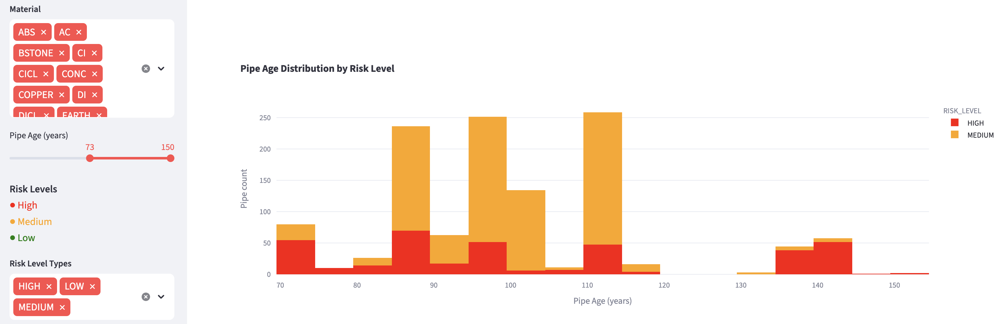
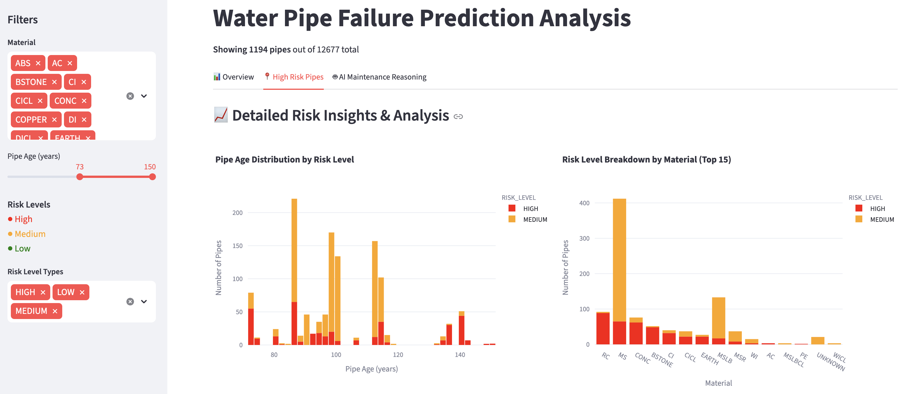
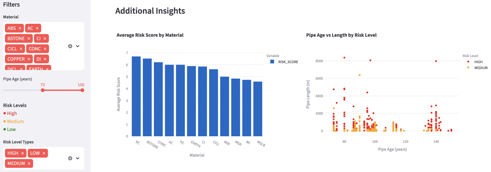
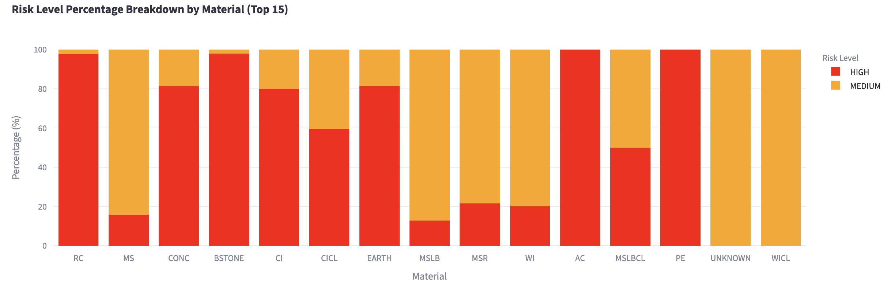

# Project 3B T126  
# Water Pipe Failure Prediction and Risk Identification

---

## Executive Summary

Water main failures create significant operational, financial, and public safety challenges for water utilities. As Melbourne’s water infrastructure continues to age, there is an increasing need for data-driven maintenance approaches that can anticipate failures before they occur. This project addresses that need by developing a machine learning-based workflow to identify water pipe failure risk and support proactive asset management.

Using historical water main break datasets, the project evaluates three supervised machine learning models: Logistic Regression, Random Forest, and XGBoost. The objective was to identify patterns and key risk drivers associated with pipe failures. These findings were then adapted to Melbourne Water’s network, which consists of thousands of kilometres of pipes with varying material, age, soil conditions, and environmental exposure.

Beyond machine learning modelling, the project also developed an interactive web-based decision support system that explores how Large Language Models (LLMs) can translate model outputs into practical maintenance recommendations. The capstone delivers four major outcomes:

- A reliable pipe failure risk identification model
- Adapted risk insights tailored to Melbourne asset conditions
- An interactive dashboard integrating AI-assisted decision support
- Actionable maintenance recommendations to support prioritisation

Overall, the project demonstrates how combining machine learning with LLM-based reasoning can support a shift from reactive maintenance towards more proactive and risk-informed water infrastructure management, helping reduce failures, costs, and service disruptions.

---

## 1. Project Overview

### 1.1 Introduction

Water main failures can cause significant operational disruption, repair costs, water loss, and public safety risks. As water infrastructure continues to age, there is increasing interest in using data-driven approaches to support proactive maintenance and risk identification.

The aim of this project is to develop a machine learning-based workflow for identifying water pipe failure risk using historical water main break data. The project focuses on identifying patterns and key risk drivers associated with pipe failures, then adapting those findings to Melbourne water main data to support risk identification and maintenance planning.

Three supervised machine learning models were developed and compared using historical overseas pipe failure datasets. The project also explores how Large Language Models (LLMs) can be used to generate maintenance recommendations based on identified risk conditions.

---

### 1.2 Project Objectives

The main objectives of the project are to:

- review and assess available water pipe datasets
- identify a suitable dataset for supervised pipe failure modelling
- preprocess and engineer pipe-level modelling features
- develop and compare multiple machine learning models
- identify key pipe failure risk drivers
- adapt modelling findings to Melbourne water main data
- develop a risk identification workflow for Melbourne assets
- explore LLM-based maintenance recommendation generation

---

## 2. Dataset Review and Selection

### 2.1 Candidate Dataset Review

Several candidate datasets were reviewed during the early stage of the project to assess their suitability for supervised water pipe failure modelling. The review focused on dataset scale, data structure, historical failure availability, feature completeness, and compatibility with the planned machine learning workflow.

| Dataset | Outcome |
|---|---|
| Melbourne Water Mains + Soil | Useful for later adaptation, but no historical failure labels for supervised modelling |
| Bozeman | Small dataset with limited records, not suitable as the primary modelling dataset |
| Netherlands reference data | Useful as reference material, but less suitable for the current flat machine learning workflow |
| Kitchener Water Mains + Breaks | Selected as the primary modelling dataset due to its strong structure and availability of historical break records |
| External Canadian soil datasets | Tested as supporting environmental data, but not used as final modelling features |

The Melbourne Water Mains and Soil datasets contained 12,680 water main records and more than 900,000 soil monitoring records. These datasets were considered useful for the later Melbourne adaptation and risk identification stages because they contained operational and infrastructure-related attributes relevant to local water assets. However, the datasets did not contain historical break labels required for supervised model training.

The Bozeman dataset included historical water main break records but contained only 158 records in total. Due to its limited size, it was not considered suitable for reliable model development or comparison across multiple machine learning approaches.

The Netherlands dataset contained 10,203 water main records together with environmental-related features. However, the historical break data was stored in a sequence-based 3D array format with shape `(10203, 6, 2)` rather than a conventional tabular structure. While the dataset was relatively complete, the sequence-based format was less compatible with the current machine learning workflow using models such as Random Forest, XGBoost, and Logistic Regression.

The Kitchener Water Mains and Breaks datasets provided the strongest balance between dataset scale, structure, and modelling suitability. The datasets contained 16,163 water main asset records and 2,994 break records, with compatible identifiers (`WATMAINID` and `Related Asset ID`) that allowed historical break events to be linked directly to individual pipe assets. This structure supported the creation of a supervised pipe-level modelling dataset suitable for classification-based machine learning workflows.

Based on the overall review, the Kitchener datasets were selected as the primary datasets for historical pipe failure modelling.

---

### 2.2 External Soil Dataset Testing

To address the absence of environmental attributes in the Kitchener datasets, two external Canadian soil datasets were tested using GIS spatial joins:

1. Ontario Soil Survey Complex (polygon-based soil survey data)  
2. CANSIS / Soil Landscapes of Canada (national soil landscape polygons and soil component tables)

The objective was to enrich Kitchener break locations with surrounding soil characteristics that may potentially influence water main deterioration or failure behaviour.

Both spatial joins achieved complete geographic coverage, with all 2,994 break records successfully matched to soil polygons. However, the Ontario Soil Survey Complex results were heavily dominated by broad urban classifications, with 2,943 records labelled as `URBAN` and 98.53% of texture values recorded as `NA`. This provided limited useful soil variation for modelling.

The CANSIS dataset produced cleaner and more complete soil attributes, but the results still showed limited diversity. Most break locations were concentrated in only three soil classes (`FOX`, `BURFORD`, and `WATERLOO`), while drainage and texture values were nearly constant across the dataset.

As a result, the external soil datasets did not provide sufficient pipe-level discriminatory value and were not included as final modelling features. Nevertheless, the testing process demonstrated the feasibility of future GIS-based environmental enrichment workflows for water infrastructure risk modelling.

---

## 3. Data Preprocessing

### 3.1 Kitchener Data Preprocessing

The Kitchener preprocessing stage converted the raw water mains and water main break datasets into a clean pipe-level dataset for supervised modelling.

The raw data contained 16,163 water main asset records and 2,994 break records. Initial cleaning removed weak fields with high missingness and operational fields that were not required for the modelling workflow. After cleaning, the mains dataset was reduced from 27 to 22 columns, while the breaks dataset was reduced from 37 to 18 columns.

The break data was originally event-level, while the mains data was asset-level. To create a supervised modelling dataset, break records were linked back to pipe assets using `Related Asset ID` from the break dataset and `WATMAINID` from the mains dataset. This matching process linked 2,452 break records to water main assets, producing an asset match rate of 81.9%. The data was then filtered to MAIN break records only, resulting in 2,451 matched MAIN break records for pipe-level aggregation.

Break history was aggregated so that each pipe was represented by a single row. For each pipe, the preprocessing created fields such as break count, first break date, last break date, and the binary target variable `has_break`. Pipes with at least one matched historical MAIN break were labelled as `has_break = 1`, while all other pipes were labelled as `has_break = 0`.

The final pipe-level dataset contained 16,163 records and 26 columns. A separate pipe master dataset with traceability fields contained 28 columns, while the final model-ready dataset contained 16,163 records and 20 columns after removing identifiers, date fields, and leakage-related fields.

The final target distribution was highly imbalanced. A total of 14,929 pipes, or 92.37%, had no observed historical break, while 1,234 pipes, or 7.63%, had at least one observed break. This class imbalance was addressed during model development through stratified splitting and evaluation metrics such as precision, recall, F1-score, ROC-AUC, and PR-AUC.

### 3.2 Melbourne Water Main Preprocessing

The Melbourne Water mains dataset was prepared for the later adaptation and risk identification stage. Unlike the Kitchener dataset, it did not include historical break labels and therefore could not be used for supervised model training.

The preprocessing workflow selected relevant asset-level fields from the raw Melbourne dataset, including pipe identifiers, material, pipe length, pipe width, construction date, relining date, field team, service status, and comments. Text fields were standardised, date fields were converted to datetime format, and invalid physical values such as non-positive pipe length or width were flagged and replaced.

Several derived features were created to support adaptation from the Kitchener model findings. These included `PIPE_AGE`, `HAS_RELINED`, and `YEARS_SINCE_RELINED`. Additional data quality flags were also created, including `MISSING_CONSTRUCTION_DATE`, `MISSING_RELINED_DATE`, `INVALID_PIPE_LENGTH`, `INVALID_PIPE_WIDTH`, and `FUTURE_RELINED_DATE`.

The final processed Melbourne dataset provides a structured pipe-level dataset for applying risk factors identified from the Kitchener modelling stage to Melbourne water main assets.

---

## 4. Model Development

### 4.1 Random Forest Model

The Random Forest model was trained using the processed Kitchener model-ready dataset with a consistent 70/15/15 train, validation, and test split. The split produced 11,314 training records, 2,424 validation records, and 2,425 test records.

The model performed strongly across both validation and test sets. On the validation set, it achieved a ROC-AUC of 0.9910, PR-AUC of 0.9678, precision of 0.9713, recall of 0.9135, and F1-score of 0.9415. On the held-out test set, the model achieved a ROC-AUC of 0.9906, PR-AUC of 0.9596, precision of 0.9508, recall of 0.9405, and F1-score of 0.9457.

The test confusion matrix showed 2,231 true negatives and 174 true positives, with only 9 false positives and 11 false negatives. This indicates that the model performed well in identifying pipes with observed historical breaks while maintaining a low number of incorrect high-risk classifications.

The feature importance results showed that `condition_score` was the most influential predictor, with an importance score of 0.4660. This was followed by `shape__length` at 0.1642 and `pipe_age` at 0.1013. Material-related features also contributed to prediction, particularly cast iron (`material_CI`) and PVC (`material_PVC`). Other contributing variables included pipe size, cleaning area, criticality, and pressure zone.

Overall, the Random Forest model provided strong predictive performance and useful interpretability. The results suggest that pipe condition, pipe length, pipe age, and material were key indicators of historical break risk in the Kitchener dataset. These findings were later used to support the Melbourne adaptation stage, where similar asset-level features were available for risk identification.

### 4.2 XGBoost Model

The XGBoost model was trained using the same processed Kitchener model-ready dataset and the same 70/15/15 train, validation, and test split used for the other models. The split produced 11,314 training records, 2,424 validation records, and 2,425 test records.

The model used the best hyperparameters identified during earlier tuning rather than rerunning Optuna in the final demonstration notebook. This kept the final workflow lightweight and reproducible. Class imbalance was handled using `scale_pos_weight`, calculated from the training set as 12.09.

On the held-out test set, XGBoost achieved a ROC-AUC of 0.9899, PR-AUC of 0.9614, precision of 0.9133, recall of 0.9676, and F1-score of 0.9396. The confusion matrix showed 2,223 true negatives, 179 true positives, 17 false positives, and 6 false negatives.

These results show that XGBoost performed very strongly, particularly in recall. It missed only 6 of the 185 break cases in the test set, making it effective for identifying high-risk pipes. However, it produced more false positives than Random Forest, meaning it was slightly more aggressive in classifying pipes as break-risk.

The feature importance results showed that `condition_score` was the most influential predictor, followed by `material`, `shape__length`, `pipe_age`, `rel_cleaning_subarea`, `pressure_zone`, and `rel_cleaning_area`. This aligns closely with the Random Forest findings and reinforces that pipe condition, material, length, age, and operational network context are important drivers of historical break risk.

Overall, XGBoost provided strong predictive performance and high break-case detection capability. It was valuable for model comparison because it offered a different modelling approach from Random Forest while still identifying similar key risk drivers.

### 4.3 Logistic Regression Model

Logistic Regression was included as a simpler and more interpretable baseline model for the Kitchener pipe failure prediction task. It used the same processed model-ready dataset and the same 70/15/15 train, validation, and test split as the other models. The split produced 11,314 training records, 2,424 validation records, and 2,425 test records.

Categorical variables were one-hot encoded after the data split to avoid leakage, and the encoded feature space contained 95 features. The features were then standardised using `StandardScaler`, fitted only on the training set and applied to the validation and test sets. Because the target variable was highly imbalanced, the model used `class_weight="balanced"` to improve detection of the minority break class.

On the validation set, Logistic Regression achieved a ROC-AUC of 0.9896, PR-AUC of 0.9544, precision of 0.8529, recall of 0.9405, and F1-score of 0.8946. On the held-out test set, it achieved a ROC-AUC of 0.9840, PR-AUC of 0.9404, precision of 0.7964, recall of 0.9514, and F1-score of 0.8670.

The test confusion matrix showed 2,195 true negatives, 176 true positives, 45 false positives, and 9 false negatives. This indicates that Logistic Regression was effective at detecting most break cases, but it produced more false positives than the tree-based models. In practical terms, this means the model was more likely to classify safe pipes as risky, which could lead to unnecessary inspection or maintenance actions.

The coefficient analysis showed that `condition_score` had the strongest influence on predictions, followed by material-related variables, `shape__length`, `pipe_age`, pressure zone, and pipe size. Since Logistic Regression is coefficient-based, the results should be interpreted as associations rather than direct causal relationships.

Overall, Logistic Regression provided a useful interpretable baseline. It achieved strong class separation and high recall, but its lower precision and F1-score compared with Random Forest and XGBoost suggest that the more flexible tree-based models were better suited to capturing complex pipe failure patterns in the Kitchener dataset.

---

## 5. Model Comparison and Melbourne Water Data Adaptation

### 5.1 Model Results

| Model | ROC-AUC | PR-AUC | Precision | Recall | F1-score | True Negatives | False Positives | False Negatives | True Positives |
|---|---|---|---|---|---|---|---|---|---|
| Logistic Regression | 0.9840 | 0.9404 | 0.7964 | 0.9514 | 0.8670 | 2195 | 45 | 9 | 176 |
| Random Forest | 0.9906 | 0.9596 | 0.9508 | 0.9405 | 0.9457 | 2231 | 9 | 11 | 174 |
| XGBoost | 0.9899 | 0.9614 | 0.9133 | 0.9676 | 0.9396 | 2223 | 17 | 6 | 179 |

The results show that all three models performed strongly on the Kitchener dataset. Logistic Regression achieved strong recall but produced the highest number of false positives, incorrectly flagging 45 non-break pipes as high-risk. This indicates that while the model was effective at detecting break cases, it would likely trigger more unnecessary maintenance actions in practice.

Random Forest achieved the highest ROC-AUC, precision, and F1-score while also producing only 9 false positives. This demonstrates a strong overall balance between identifying break-risk pipes and minimising false alarms.

XGBoost achieved the highest PR-AUC and recall while also producing the fewest false negatives, missing only 6 actual break cases. This makes XGBoost the strongest model for operational risk screening, where failing to identify high-risk pipes is more critical than generating additional inspections.

Overall, Random Forest demonstrated the strongest balanced performance, while XGBoost demonstrated the strongest break detection capability.

### 5.2 Model Ranking

| Model | ROC-AUC | PR-AUC | Precision | Recall | F1-score | ROC-AUC Rank | PR-AUC Rank | Precision Rank | Recall Rank | F1-score Rank |
|---|---|---|---|---|---|---|---|---|---|---|
| Logistic Regression | 0.9840 | 0.9404 | 0.7964 | 0.9514 | 0.8670 | 3 | 3 | 3 | 2 | 3 |
| Random Forest | 0.9906 | 0.9596 | 0.9508 | 0.9405 | 0.9457 | 1 | 2 | 1 | 3 | 1 |
| XGBoost | 0.9899 | 0.9614 | 0.9133 | 0.9676 | 0.9396 | 2 | 1 | 2 | 1 | 2 |

The ranking comparison confirms that the tree-based models substantially outperformed Logistic Regression across nearly all evaluation metrics. Random Forest ranked highest overall due to its superior ROC-AUC, precision, and F1-score, indicating the strongest balanced classification performance.

XGBoost ranked highest for PR-AUC and recall, showing that it was most effective at identifying actual break-risk pipes. Although it produced slightly more false positives than Random Forest, it also missed fewer actual break cases.

These findings suggest that Random Forest was the strongest balanced model overall, while XGBoost was the preferred operational model when prioritising maximum break detection and minimising missed failures.

### 5.3 Consolidated Risk Drivers for Melbourne Adaptation

After comparing the three Kitchener models, the next step was to identify which risk drivers were consistent across models and transferable to the Melbourne Water dataset.

The trained Kitchener models were not directly applied to Melbourne because the Melbourne dataset does not contain confirmed historical break labels. Instead, the model findings were used to build an interpretable risk identification framework based on asset characteristics available in Melbourne.

| Risk Driver | Evidence from Kitchener Models | Melbourne Field | Transferability | Use in Melbourne Risk System |
|---|---|---|---|---|
| Pipe Age | Important in tree-based models and linked to deterioration over time | `PIPE_AGE` | High | Older pipes receive higher risk weighting |
| Pipe Length | Strong driver in Random Forest and Logistic Regression | `PIPE_LENGTH` | High | Longer pipe segments receive higher risk weighting |
| Material | Material-related features contributed to prediction | `MATERIAL` | High | Higher-risk materials receive higher risk weighting |
| Pipe Size / Width | Moderate contribution in Random Forest and XGBoost | `PIPE_WIDTH` | Medium | Used as a supporting physical risk factor |
| Condition / Asset Health | Strongest Kitchener driver through `condition_score` | Not directly available | Limited | Approximated using pipe age and relining status |
| Relining / Maintenance History | Lining-related features had lower importance but remained relevant | `HAS_RELINED`, `YEARS_SINCE_RELINED` | Medium | No relining or older relining increases risk |
| Network / Operational Context | Pressure zone and cleaning area contributed to prediction | `MAIN_LINE_TYPE`, `MAIN_CLASS`, `FIELD_TEAM` | Medium | Used for grouping and explanation |

The most transferable risk drivers were pipe age, pipe length, material, and pipe width because these fields were available in the Melbourne dataset or could be directly derived.

The main limitation was condition score. It was the strongest Kitchener predictor, but it was not available in the Melbourne dataset. Therefore, condition-related risk was approximated using proxy variables such as pipe age and relining status.

Network and operational fields were not exact matches between Kitchener and Melbourne, but they remained useful for grouping, explanation, and later LLM-based maintenance recommendations.

---

## 6. Melbourne Risk Scoring and Dashboard Analysis

The web-based dashboard system provides an interactive visual analysis of pipe failure risk across Melbourne’s water network using the `melbourne_risk_llm_ready.csv` dataset. The analysis was based on 12,677 pipe records with pre-computed risk scores derived from fields such as `RISK_SCORE`, `RISK_LEVEL`, `RISK_REASONS`, `RECOMMENDED_ACTION`, and other asset attributes.

The main asset features used in the Melbourne risk scoring workflow included `PIPE_AGE`, `MATERIAL`, `PIPE_LENGTH`, `MAIN_NAME` (location), `DATE_OF_CONSTRUCTION`, `HAS_RELINED`, `MAIN_LINE_TYPE`, and `MAIN_CLASS`. Risk levels were categorised into HIGH, MEDIUM, and LOW to support prioritisation and maintenance planning.

The XGBoost model, which achieved the highest PR-AUC during the Kitchener modelling stage, was selected as the primary reference model for the Melbourne risk scoring workflow due to its strong break detection capability.

The dashboard helps engineering and operational maintenance teams analyse pipes across different risk categories. For example, the analysis of pipes aged 60 years and above showed that out of 3,106 pipes:
- 472 pipes (15.2%) were classified as HIGH risk
- 2,630 pipes (84.7%) were classified as MEDIUM risk
- 4 pipes (0.1%) were classified as LOW risk

This provides a high-level overview of ageing infrastructure requiring prioritised inspection or maintenance planning.

The dashboard also provides a pipe age distribution analysis by risk level. The following chart shows that pipes above approximately 73 years old were primarily concentrated within the MEDIUM and HIGH risk categories. This allows maintenance teams to focus on ageing infrastructure with elevated estimated risk levels.

Additional analysis compares pipe age distribution against material type and risk level. Interactive filtering through the dashboard allows users to adjust pipe age ranges and observe changes in risk distribution in real time. This supports more detailed prioritisation and infrastructure planning.

The material-based analysis showed consistent differences in estimated risk levels across pipe materials. RC pipes recorded the highest average risk scores, followed by BSTONE and CONC, while MSLB showed comparatively lower risk levels. The percentage distribution across risk categories further supports maintenance prioritisation decisions.

Overall, the dashboard system successfully transforms raw pipe asset data into clear and interactive risk-based visual analysis. The workflow demonstrates the value of combining machine learning-derived risk scoring, interactive visualisation, and LLM-assisted reasoning to support proactive water infrastructure management.

Although the current system uses adapted risk scoring rather than Melbourne-specific supervised prediction, it provides a strong foundation for future enhancement using real Melbourne historical failure data and live operational integration.

---

## 7. LLM-Based Maintenance Recommendation Framework

### 7.1 Purpose of LLM Integration

The machine learning models developed in this project produce numerical risk outputs such as risk scores, classification labels, and feature importance values. While these outputs are useful for technical analysis, they are not always easily interpretable for operational maintenance planning.

To improve interpretability and usability, a Large Language Model (LLM) recommendation layer was integrated into the final dashboard workflow. The purpose of this stage was to translate model outputs into concise maintenance reasoning that can support asset prioritisation and infrastructure decision-making.

The LLM component was implemented through a Streamlit dashboard interface and connected using the Groq API [5], [6]. The workflow allows users to select individual pipes and generate AI-assisted maintenance explanations based on estimated risk conditions and key infrastructure attributes.

The generated output is intended to support engineering judgement rather than replace professional maintenance assessment.

### 7.2 LLM Input Features

The LLM recommendation workflow uses selected pipe-level fields from the Melbourne adaptation dataset together with generated risk scoring outputs.

The final LLM-ready dataset contains:
- pipe identifier
- material
- pipe age
- pipe length
- relining indicators
- estimated risk score
- estimated risk level

The recommendation system uses structured prompt engineering to generate consistent maintenance reasoning outputs. The prompts instruct the LLM to:
- explain the estimated risk level
- identify contributing infrastructure characteristics
- recommend practical maintenance actions
- explain maintenance prioritisation reasoning

The workflow also includes a fallback rule-based explanation system to ensure the dashboard remains operational if the API becomes unavailable or fails during deployment.

### 7.3 Example High-Risk Pipe Outputs

For high-risk pipes, the generated outputs typically identified ageing infrastructure, pipe material, and physical dimensions as contributing factors to elevated risk levels.

Example recommendation themes included:
- prioritised inspection scheduling
- preventative maintenance planning
- CCTV or condition assessment investigation
- replacement consideration for ageing assets
- monitoring of long pipe segments or higher-risk materials

The generated explanations consistently referenced estimated risk levels together with important infrastructure attributes such as pipe age and material type.

The recommendation outputs were formatted into three sections:
- Risk Explanation
- Maintenance Recommendations
- Priority Reasoning

This structure improved readability and provided a clearer operational interpretation of the machine learning outputs.

### 7.4 Practical Use Case

The final workflow demonstrates how machine learning and LLM-assisted reasoning can support proactive infrastructure maintenance planning.

A practical deployment scenario would involve Melbourne Water operators using the dashboard to:
1. filter water main assets based on risk level
2. inspect high-risk pipes
3. review AI-generated maintenance explanations
4. prioritise inspection and maintenance activities

The dashboard was deployed using Streamlit Community Cloud [5], allowing reviewers and team members to access the system without requiring local installation or API configuration.

API credentials were securely managed using Streamlit Secrets [6] rather than storing keys directly within the repository.

Overall, the integrated workflow demonstrates how risk scoring, interactive dashboards, and AI-assisted explanation systems can improve operational visibility and support more proactive water infrastructure management.

---

## 8. Discussion and Limitations

The project successfully demonstrated that machine learning models can identify meaningful patterns associated with historical water pipe failures. Across all three models, pipe condition, age, material, and physical dimensions consistently appeared as the strongest indicators of break risk.

The comparison results showed that the tree-based models performed better than Logistic Regression for this problem. Random Forest achieved the strongest balanced performance overall, while XGBoost achieved the highest recall and lowest false negative rate, making it more effective for identifying high-risk pipes.

Several limitations were identified throughout the project.

The Kitchener dataset was highly imbalanced, with only 7.63% of pipes representing observed break cases. Although evaluation metrics such as recall, PR-AUC, and F1-score were prioritised to address imbalance effects, the minority class remains difficult to model perfectly.

The Melbourne Water adaptation stage also introduced limitations because no historical break labels were available for supervised training. As a result, the Melbourne workflow relied on transferring risk drivers identified from the Kitchener models rather than directly training a Melbourne-specific prediction model.

The external GIS soil datasets also showed limited feature variation and low discriminatory value after spatial joining, reducing their usefulness for final modelling.

The dashboard and risk scoring workflow should also be viewed as a supporting decision-making tool rather than a fully operational predictive maintenance platform. The current workflow uses estimated risk scoring adapted from Kitchener model findings rather than Melbourne-specific supervised predictions due to the absence of local historical break records.

The LLM recommendation system also has practical limitations. Generated outputs depend heavily on prompt quality and available infrastructure attributes. While the generated explanations were generally useful and consistent, they may occasionally produce broad or simplified maintenance recommendations. For this reason, the system should be viewed as a decision-support tool rather than a replacement for engineering expertise.

### Future Improvements

Several future improvements could strengthen the workflow and improve practical deployment capability:

- improve data quality by incorporating additional infrastructure and environmental features such as `SOIL_TYPE`, relining records, pressure zones, and traffic load
- standardise data collection processes for future pipe installation and repair records
- collect historical Melbourne pipe failure records to support supervised model training
- retrain the XGBoost model using Melbourne-specific historical data
- integrate live operational or sensor-based infrastructure data
- develop GIS-based interactive spatial visualisation
- improve risk scoring into true probability-based failure prediction
- integrate with enterprise asset management (EAM) systems
- explore infrastructure-specific fine-tuned language models for maintenance recommendation generation

Despite these limitations, the current Minimum Viable Product (MVP) demonstrates a practical and scalable workflow for infrastructure risk identification, dashboard-based analysis, and AI-assisted maintenance support.

---

## 9. Conclusion

This project developed an end-to-end workflow for water pipe failure risk identification and AI-assisted maintenance recommendation.

The Kitchener Water Mains and Breaks datasets were selected as the primary supervised modelling source due to their historical break records and compatible pipe-level structure. Three machine learning models were developed and evaluated: Logistic Regression, Random Forest, and XGBoost.

All models achieved strong predictive performance. Random Forest demonstrated the strongest balanced classification performance, while XGBoost achieved the strongest operational break detection capability through high recall and low false negatives.

The modelling process consistently identified pipe condition, pipe age, material, and pipe length as the most important drivers of historical break risk. These findings were then adapted to Melbourne Water infrastructure data to support an interpretable risk identification workflow despite the absence of historical Australian break labels.

To improve operational usability, the final system integrated a Streamlit dashboard and an LLM-based recommendation framework capable of generating maintenance explanations and prioritisation reasoning for selected assets.

Overall, the project demonstrates how machine learning, interactive dashboard systems, and AI-assisted explanation workflows can support more proactive and risk-informed water infrastructure management. The developed workflow also provides a strong foundation for future enhancement using real Melbourne failure records, live operational integration, and more advanced predictive maintenance systems.

---

## References
[1] Y. Zhang, “water-pipes-failure-prediction,” GitHub repository, 2020. [Online]. Available: [GitHub Repository](https://github.com/yingqianzhang/water-pipes-failure-prediction). [Accessed: 14-May-2026].

[2] J. Verheugd, P. R. de Oliveira da Costa, R. Refaei Afshar, Y. Zhang, and S. Boersma, “Predicting Water Pipe Failures with a Recurrent Neural Hawkes Process Model,” in *Proc. IEEE Int. Conf. Systems, Man, and Cybernetics (SMC)*, 2020. :contentReference[oaicite:1]{index=1}

[3] City of Kitchener, “Water Main Breaks,” Kitchener GeoHub Open Data Portal, 2018. [Online]. Available: [Kitchener Water Main Breaks Dataset](https://open-kitchenergis.opendata.arcgis.com/datasets/KitchenerGIS%3A%3Awater-main-breaks/about). [Accessed: 14-May-2026].

[4] City of Kitchener, “Water Main Breaks - Overview,” ArcGIS Online, 2018. [Online]. Available: [ArcGIS Dataset Overview](https://www.arcgis.com/home/item.html?id=34627cd277084a47ab8558c97fa63a27&). [Accessed: 14-May-2026].

[5] Streamlit Inc., “Streamlit Documentation,” 2026. [Online]. Available: https://streamlit.io/
. [Accessed: 13-May-2026].

[6] Groq Inc., “Groq API Documentation,” 2026. [Online]. Available: https://console.groq.com/docs
. [Accessed: 13-May-2026].

[7] Internal project dataset shared via Microsoft Teams communication, “Bozeman Water Main Break Dataset,” 2026.

[8] Melbourne Water, “Melbourne Water Main Asset Dataset,” internal operational dataset provided for Deakin University SIT374 Capstone Project, 2026.

[9] Melbourne Water, “Melbourne Soil Monitoring Dataset,” internal operational dataset provided for Deakin University SIT374 Capstone Project, 2026.
