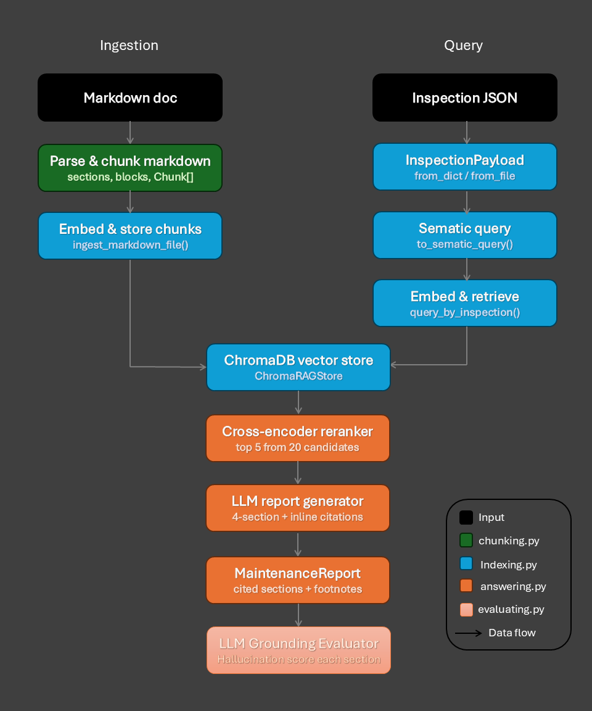

# Project Description


# RAG Pipeline 

## Library installation

## Architecture


## Stage 1: Document preparation

## Stage 2: Embedding, storage, and retrieval

## Stage 3: Reranking and report generation

## Stage 4: Hallucination auditing

## Example output
To demonstrate the RAG pipeline in action, run:

```bash
python main.py
```

This produces output showing how crack metrics can be transformed into a maintenance report.
```
==============================================================
 CRACK METRICS IN JSON FORMAT
==============================================================
  InspectionPayload(image_id='bridge_01.jpg', crack_detected=True, crack_area_ratio=0.054, estimated_crack_length_px=438, num_crack_regions=3, severity='High', model_confidence=0.91)

==============================================================
  TRANSFORM CRACK METRICS INTO NATURAL LANGUAGE QUERY
==============================================================
  High severity crack detected on bridge structure. Crack area ratio 0.0540, estimated length 438px across 3 region(s). Model confidence 0.91. Recommended repair actions and inspection schedule for high severity concrete cracking.
Search returned 20 result(s).
Search returned 5 result(s).

==============================================================
  STRUCTURAL INSPECTION MAINTENANCE REPORT
==============================================================
  Asset / Image  : bridge_01.jpg
  Severity       : High
  Generated At   : 2026-03-24T07:57:42.071570+00:00
==============================================================

──────────────────────────────────────────────────────────────
  1. FINDINGS SUMMARY
──────────────────────────────────────────────────────────────
  The inspection of bridge_01.jpg identified crack presence as True, with a crack area ratio of 0.0540 and an estimated crack length of 438 px. The crack was detected in 3 distinct crack regions. The reported severity was High, and the model confidence was 0.91.

──────────────────────────────────────────────────────────────
  2. RISK ASSESSMENT
──────────────────────────────────────────────────────────────
  Cracking of structural significance may indicate overstress; however, most forms of concrete deterioration are generally most significant in their effects on durability rather than strength. [3] Given the reported High severity, the condition should be treated as potentially significant and further crack characterization should be undertaken to support assessment and maintenance decisions. [1] The inspection reporting should include crack length, width, location, and orientation (horizontal, vertical, diagonal, etc.), and should also note whether rust stains, efflorescence, or evidence of differential movement are present on either side of the crack. [1] Cracks may also be an indication of overloading, corrosion of the reinforcing steel, or settlement of the structure, and these potential causes should be considered during follow-up evaluation. [2]

──────────────────────────────────────────────────────────────
  3. RECOMMENDED REPAIR ACTIONS
──────────────────────────────────────────────────────────────
  1. Each crack should be reported with its length, width, location, and orientation, and the presence of rust stains, efflorescence, or evidence of differential movement on either side of the crack should be documented to support cause identification and selection of treatment. [1]
  2. Once the cause of cracking has been established beyond doubt, and any possible steps have been taken to avoid further movement, the structure may be restored to its original strength and durability by injecting the cracks full depth with epoxy resin specifically developed for such an application. [4]
  3. If the crack width is more than 0.1 mm and the surfaces of the concrete in the crack are clean and sound, cracks can be successfully filled and repaired by specialised controlled pressure-injection techniques. [4]

──────────────────────────────────────────────────────────────
  4. INSPECTION SCHEDULE / NEXT STEPS
──────────────────────────────────────────────────────────────
  1. A follow-up inspection should be performed to complete the required crack characterization (length, width, location, and orientation) and to document rust stains, efflorescence, and any evidence of differential movement on either side of the crack. [1]
  2. The inspection and maintenance process should include cause determination “beyond doubt” prior to selecting full-depth epoxy resin injection, and should confirm that steps have been taken to avoid further movement before repair is undertaken. [4]
  3. Re-inspection should be scheduled to monitor the condition after any remedial actions, consistent with the need to establish and manage ongoing movement and to support durability-focused maintenance decisions. [3][4]

──────────────────────────────────────────────────────────────
  REFERENCES
──────────────────────────────────────────────────────────────
  SOURCES:
    [1] Austroads Guide to Bridge Technology Part 7 — 5. Maintenance > Prestressed Concrete Substructures
    [2] Austroads Guide to Bridge Technology Part 7 — 5. Maintenance > Prestressed Concrete Decks
    [3] Austroads Guide to Bridge Technology Part 7 — 4. Bridge Assessment and Load Rating > Concrete
    [4] Austroads Guide to Bridge Technology Part 7 — 6. Rehabilitation and Strengthening Treatments > Active cracks

==============================================================

==============================================================
  RETRIEVED CONTEXT FROM VECTOR STORE AND RERANKING
==============================================================
  When reporting cracks record the length, width, location, and orientation (horizontal, vertical, diagonal, etc.) of each crack. Also indicate the presence of rust stains, efflorescence, or evidence of differential movement on either side of the crack. Cracks may also be an indication of overloading, corrosion of the reinforcing steel, or settlement of the structure. Report each crack in terms of; the length, width, location, and orientation (horizontal, vertical, diagonal, etc.). Also, indicate the presence of rust stains, efflorescence, or evidence of differential movement on either side of the crack. While cracking of structural significance may indicate overstress, most forms of concrete deterioration (spalling, scaling, efflorescence) usually are most significant in their effects on durability rather than strength. Once the cause of cracking has been established beyond doubt, and any possible steps have been taken to avoid further movement, it is possible to restore the structure to its original strength and durability by injecting the cracks full depth with epoxy resin specifically developed for such an application. Provided that the surfaces of the concrete in the crack are clean and sound, cracks can be successfully filled and repaired by specialised controlled pressure-injection techniques if their width is more than 0.1 mm.

==============================================================
  EVALUATION OF REPORT
==============================================================
  Risk of hallucination: low
  risk_assessment: low - The section’s key claims are largely supported by the retrieved context: it advises recording crack length/width/location/orientation and noting rust stains/efflorescence/differential movement; it also states cracks can indicate overloading, reinforcing steel corrosion, or settlement. The statement that cracking of structural significance may indicate overstress and that concrete deterioration is often more significant for durability than strength is also consistent with the context. Minor potential overreach: it recommends further crack characterization based on 'reported High severity' and mentions maintenance decisions, which are not explicitly detailed in the context, but this is a reasonable extension rather than a clear contradiction. No clear unsupported technical claims (e.g., epoxy injection details) are introduced.

  repair_actions: low - All three repair-action claims closely match the retrieved context: documenting crack length/width/location/orientation and signs (rust stains, efflorescence, differential movement); restoring strength/durability via full-depth epoxy injection after the cause is established and movement prevented; and using controlled pressure-injection for cracks >0.1 mm when surfaces are clean and sound. No additional unsupported technical requirements or steps are introduced.

  inspection_schedule: low - All three items are consistent with the retrieved context: (1) crack characterization plus documentation of rust stains/efflorescence/differential movement is explicitly required; (2) the context states cause must be established beyond doubt and that steps must be taken to avoid further movement before full-depth epoxy injection; (3) the context supports re-establishing/monitoring movement to support durability-focused decisions, though it does not explicitly mention scheduling timing—only that cause and movement avoidance are prerequisites for repair.
```