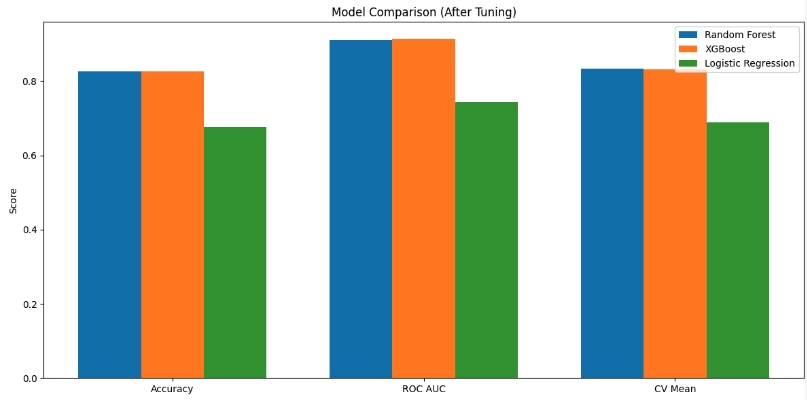
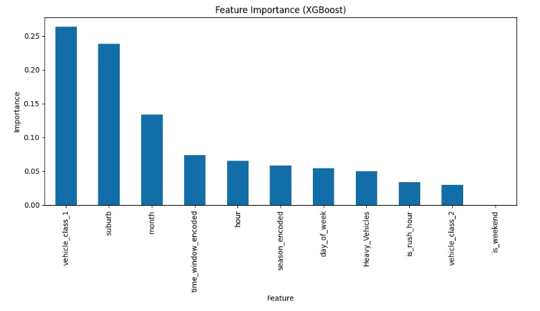
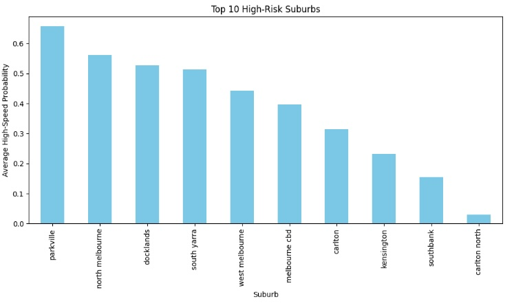
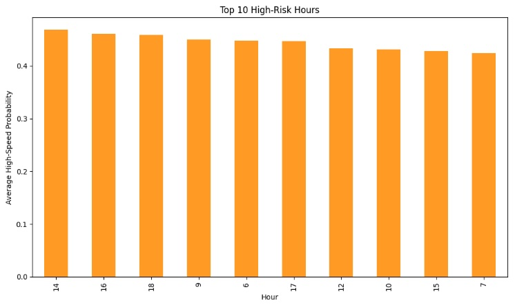
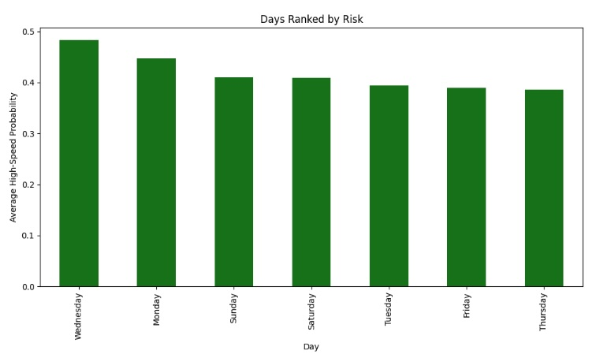
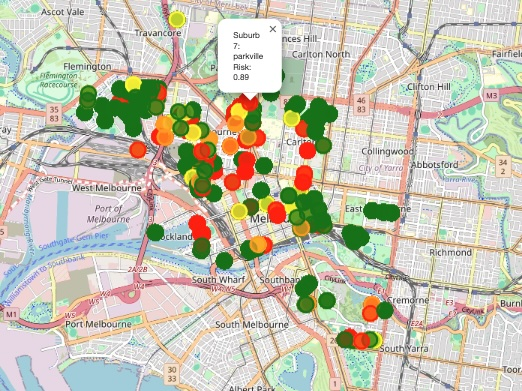
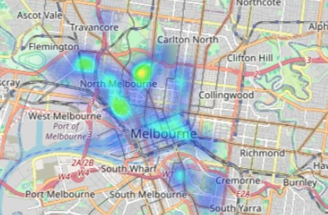

# Task 2
## Introduction

The goal of Task 2 under Use Case 10 is to "Identify high-speed zones and assess compliance with speed limits to improve road safety".

To achieve this, I undertook several tasks to identify areas likely to encounter speeding.

Most of this analysis relates to the "Speed analysis models.ipynb" file. The final 2 maps are from the "Speed analysis mapping.ipynb" file.

### Data Sources 

Two datasets were utilised from Melbourne Open Data. The "traffic-count-vehicle-classification-2014-2017.csv" file and "road-corridors.csv" file. 

Links to the files can be found here:

- https://data.melbourne.vic.gov.au/explore/dataset/traffic-count-vehicle-classification-2014-2017/information/
- https://data.melbourne.vic.gov.au/explore/dataset/road-corridors/information/

## Installation

To use this data, you will need to install the following packages:

- `pandas`
- `numpy`
- `sklearn` (LabelEncoder, StandardScaler, train_test_split, GridSearchCV, cross_val_score)
- `sklearn.ensemble` (RandomForestClassifier)
- `sklearn.linear_model` (LogisticRegression)
- `sklearn.metrics` (classification_report, confusion_matrix, roc_auc_score)
- `xgboost` (XGBClassifier)
- `matplotlib.pyplot`

This was conduced in a Jupyter notebook running Python 3.11.

## Data preparation

These datasets were linked on the road_segment and seg_id columns. The data was cleaned and merged, with comments on the steps taken available in the Datapreprocessing pipeline folder files.

From this, the "merged_traffic_data.csv" was created which was utilised for this task.

To tackle this task I wanted to utilise a machine learning model to discover and predict speeding incidents.

Additional features were engineered to enhance the model's performance:
- Day of the Week: Extracted from the date column to capture weekday/weekend patterns.
- Month: Derived from the date column to identify monthly variations.
- Season: Derived from the month to identify seasonal variations in speeding.
- Time Windows: Created to distinguish between Morning, Afternoon, Evening, and Night.
- Rush Hour: A binary feature indicating if the data point falls within peak traffic hours (7-9 AM and 4-6 PM).
- Vehicle Class Consolidation: Heavy vehicle classes (3-12) were combined into a single category to manage sparse data.

I also generated an 'is_speeding' feature as our target variable. This was calculated from the 'maximum_speed' and 'speed_limit' features.

Other possible features for the speeding threshold, such as 'average_speed' and '85th_percentile_speed', were considered, but 'maximum_speed' was used as it was most relevant.

Relevant features were then selected as our x variables, to predict our target is_speeding variable.

## Model Selection

For this binary classification task (speeding against non speeding), I selected three models:

Random Forest: Chosen for its ability in handling non-linear data and its ability to provide feature importance insights.
XGBoost: Selected due high accuracy in classification tasks.
Logistic Regression: Used for its simplicity and interpretability, helping to understand linear relationships between features and speeding behavior.

A combination of models was used to explore the best approach for the data.

I employed GridSearchCV to find the best parameters for each model. Accuracy, ROC AUC and Cross validation were used to evaluate the models and select the best fit.

The best resulting parameters for each model were:
- Random Forest Best parameters: {'max_depth': 20, 'min_samples_leaf': 1, 'min_samples_split': 10, 'n_estimators': 100}

- XGBoost Best parameters: {'learning_rate': 0.1, 'max_depth': 7, 'n_estimators': 200}

- Logistic Regression Best parameters: {'C': 0.1, 'penalty': 'l1', 'solver': 'saga'}

Below shows a comparison of the each model with the best parameters found in the gridsearch:

As can be seen, the Random Forest and XGBoost models performed the best. The Logistic Regression model performed weaker but still with reasonable performance.

XGB received slightly higher results than Random Forest, with an ROC AUC of 0.9135 compared to Random Forest's 0.9101. As a result the XGB was the model utilised going forward.

Regarding it scores, the XGB model performed well, with an accuracy meaning 83% of predictions were correct. Its ROC AUC of 0.9135 indicates strong ability to distinguish between the classes (True vs. False), suggesting good overall classification performance. The cross-validation mean of 0.8325 shows that the model's performance is stable across different data splits.

Feature importance was performed for the XGB, showing that vehicle_class_1 (0.2638) and suburb (0.2378) are the most influential factors in predicting the outcome of speeding contributing to the model's decisions. Month (0.1333) and time_window_encoded (0.0735) also play slight roles, while features like is_weekend (0.0000) have no impact. 

The feature importances are relatively low, with the highest being only 0.2638, indicating no single feature strongly drives predictions. This suggests the model relies on a combination of features.

## Utilising XGB model to predict speeding probabilities

The strongest XGB model was then used to predict speeding probabilties on the test data. A few key areas were focused on for results: high risk suburbs, times (by hour), and days of the week.

We can see that the Parkville was found to be the suburb most at risk of speeding with a 65.64% chance of speeding. North Melbourne, Docklands, South Yarra also were found to have greater than 50% chance of speeding. Suburbs such as Southbank and Carlton North were found to have a lower risk of speeding out of the high risk suburbs, receiving 15 and 2.9% respectively.

For hours, 2 PM was considred the most likely with a 46.86% chance of speeding. The results show there was considered to the highest risk at 4-6pm and at 6 and 9 am.

Wednesday was found to be the most likely day of the week to speed with a 48% chance. This was folloed by Monday and Sunday, whereas Thursday was considered the least likely.

## Visualisations

To give visual insights, the predictions on different areas in each suburbs on the test data can be seen in this map. It allows for checking the location and the likelihood of speeding.

To allow for insights into speeding, I also generated maps of the recorded speeding incidents from the original data, which are within the "Speed analysis mapping.ipynb" file. Two variations were generated, one allowing to see the actual numbers, and other providing a heat map to give different insights into the data. Both of which are interactive allowing users to zoom in to see finer detail. 

### Numerical marker map

### Heatmap

## Conclusion

This investigation was able to undertake speed analysis to discover high speed zones in Melbourne, discovering areas that both were and were not compliant. It can assist deciding which areas of the city will require greater monitoring for speeding incidients, as well as highlighting specific days and times that are more likely to have speeding incidients.

Specifically, suburbs such as Parkville, North Melbourne, Docklands, and South Yarra were found to be high risk areas for speeding. Wednesday was found to be the day most likely to have speeding incidients recorded. The hours of 2 and 4pm were the most likely to record speeding.

Going forward, further modifications could be made to discover more granular data or search for more useful data. Getting more detailed speeding data on a variety of streets would be insightful, as well as more up to date data since this dataset is from 2014-2017.
